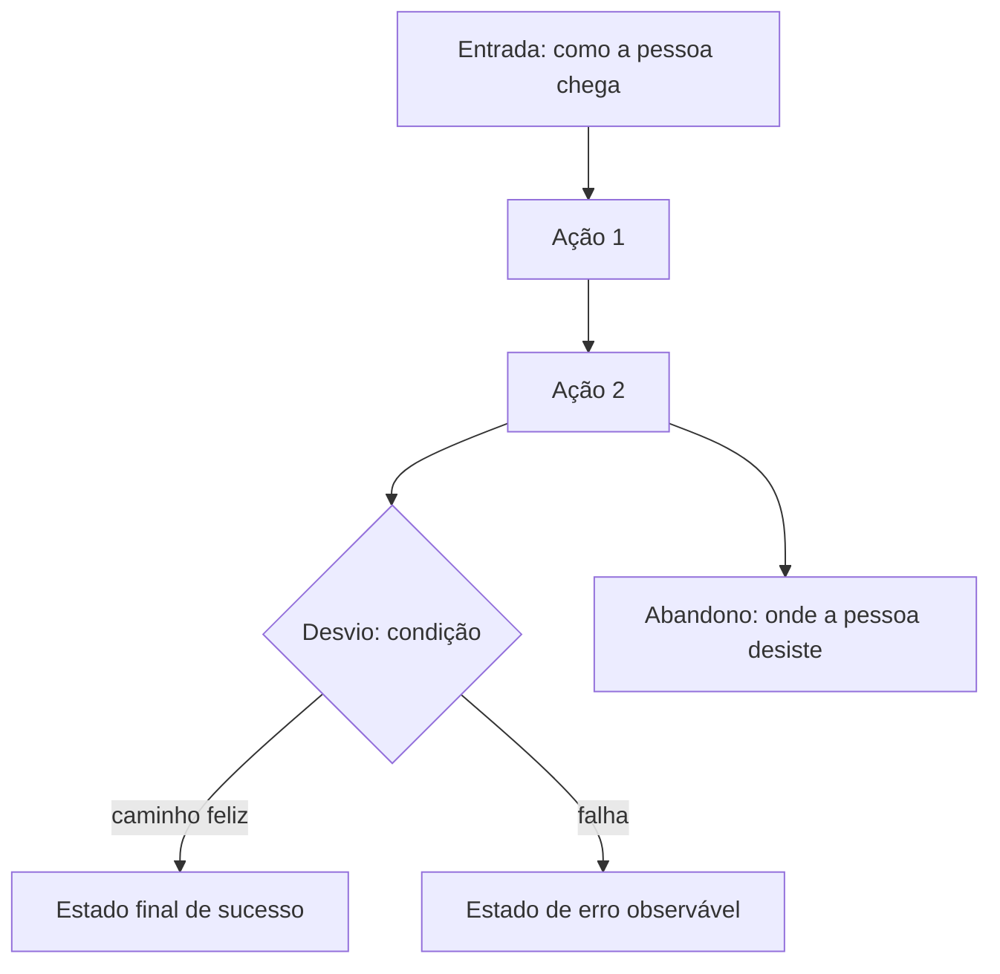

# Grupo de skills de QA contínuo (`qa/`) — Implementation Plan

> **For agentic workers:** REQUIRED SUB-SKILL: Use superpowers:subagent-driven-development (recommended) or superpowers:executing-plans to implement this plan task-by-task. Steps use checkbox (`- [ ]`) syntax for tracking.

**Goal:** Acrescentar ao bundle SDD duas skills novas — `criar-plano-qa` e `executar-sessao-qa` — que cobrem QA desacoplado de uma feature/PRD única (regressão, exploratório, sign-off de release), agrupadas na pasta `qa/`, sem alterar nenhuma das 7 skills do fluxo.

**Architecture:** As duas skills vivem em `qa/<nome>/SKILL.md` (dois níveis abaixo da raiz do bundle) e escrevem numa árvore viva no projeto (`docs/qa/` por padrão), com `run.yaml` e `memoria/` seguindo a mesma disciplina retomável das 7 skills existentes. Como o Claude Code não descobre `SKILL.md` aninhado, `configurar-sdd` grava atalhos em `.claude/commands/` apontando para o caminho real — o mesmo mecanismo que já existe para `.sdd/configurar-sdd` e `.sdd/atualizar-sdd`. A camada inteira é opt-in por um bloco novo `<qa_continuo>` no `sdd.config.md`.

**Tech Stack:** Markdown (`SKILL.md` com frontmatter YAML do Claude Code), YAML (`run.yaml`), Mermaid (fluxogramas de jornada), `grep`/shell para verificação, `git` para versionamento.

**Spec:** `docs/superpowers/specs/2026-09-13-sdd-qa-continuo-design.md`

## Global Constraints

Estas regras valem para **todas** as tarefas. Cada tarefa as inclui implicitamente.

1. **Idioma:** todo o conteúdo é escrito em português (PT-BR). Termos técnicos consagrados (commit, branch, lint, coverage, smoke, tour, charter) permanecem em inglês.

2. **Profundidade de caminho — a diferença mais fácil de errar neste plano.** As 7 skills de fluxo vivem em `<bundle>/criar-prd/` e referenciam `../sdd.config.md`. As skills novas vivem em `<bundle>/qa/criar-plano-qa/`, **um nível mais fundo**, e por isso usam:
   - config: `../../sdd.config.md`
   - baselines: `../../.sdd/_shared/SECURITY_BASELINE.md`, `../../.sdd/_shared/QUALITY_BASELINE.md`, `../../.sdd/_shared/REGRAS_DE_CONFIANCA.md`
   - modelos de processo/memória: `../../.sdd/_shared/RUN_TEMPLATE.md`, `../../.sdd/_shared/MEMORIA_TEMPLATE.md`

   Nunca `../sdd.config.md` numa skill de `qa/`.

3. **Nenhum arquivo pode assumir stack.** Nenhuma linguagem, framework, ferramenta de teste ou comando específico pode aparecer como fato — só como *exemplo explicitamente marcado* (linha contendo `ex.:`, `ex:` ou `por exemplo`). Sweep de verificação (roda na raiz do bundle):

```bash
grep -rniE 'flutter|\bdart\b|pubspec|\bbloc\b|cubit|modular|dartz|mocktail|nestjs|golden|playwright|cypress|selenium|appium|\bjest\b|vitest' \
  qa/ 2>/dev/null | grep -viE 'ex\.?:|por exemplo|exemplo:'
```

   Saída esperada em todas as tarefas: **vazia**.

4. **Severidade de bug é uma escala só no bundle inteiro:** `Crítica`, `Alta`, `Média`, `Baixa`. Nunca introduza uma segunda rubrica (a de 5 níveis do `pedronauck/skills` fica de fora, por decisão do spec).

5. **Nenhuma das 7 skills de fluxo pode ser modificada.** Ao fim da Task 7, `git diff` nas pastas `criar-prd/ criar-techspec/ criar-tasks/ executar-task/ executar-qa/ executar-bugfix/ executar-review/` precisa estar vazio.

6. **Camada opt-in:** as duas skills novas PARAM se `<qa_continuo>` não existir no config ou estiver com `Ativo: não`. Nenhuma delas cria a árvore sem o config autorizar.

7. **Bloco de tags padrão:** toda skill nova recebe, logo após o frontmatter, os blocos `<config>`, `<baseline_seguranca>`, `<baseline_qualidade>`, `<regras_confianca>`, `<processo>`, `<memoria>`, `<contexto_projeto>`, seguidos dos `<critical>` de config/confiança/processo/memória — no mesmo texto que as 7 skills já usam, só com os caminhos do item 2.

8. **Commits:** Conventional Commits, mensagem em português, um commit por task.

9. **Texto próprio:** `pedronauck/skills` (sem licença declarada) é inspiração conceitual. Nenhum trecho de texto de lá pode ser copiado.

---

### Task 1: Fundação — bloco `<qa_continuo>` no config e modelos de processo/memória

**Files:**
- Modify: `.sdd/configurar-sdd/references/CONFIG_TEMPLATE.md` (inserir bloco novo entre `<artefatos_sdd>` e `<meta_sdd>`)
- Modify: `.sdd/_shared/RUN_TEMPLATE.md` (nota de escopo + catálogo de passos das 2 skills novas)
- Modify: `.sdd/_shared/MEMORIA_TEMPLATE.md` (nota de escopo)

**Interfaces:**
- Consumes: nada (primeira tarefa)
- Produces: o bloco `<qa_continuo>` com os campos `Ativo`, `Pasta raiz da árvore viva de QA` e `Arquivos/pastas` — lido por `criar-plano-qa`, `executar-sessao-qa`, `configurar-sdd` e `atualizar-sdd`. Produz também os nomes de passo canônicos das duas skills novas no catálogo de `RUN_TEMPLATE.md`, usados literalmente no campo `nome` de cada passo do `run.yaml`.

> **Desvio do spec, deliberado:** o inventário do spec não lista `RUN_TEMPLATE.md`/`MEMORIA_TEMPLATE.md` como modificados, mas o spec exige que as skills novas usem "a mesma disciplina de `run.yaml`/`memoria`". Sem os passos 1-3 desta task, as duas skills novas apontariam para um modelo que diz "um arquivo por feature" e cujo catálogo não as conhece.

- [ ] **Step 1: Inserir o bloco `<qa_continuo>` no `CONFIG_TEMPLATE.md`**

Abra `.sdd/configurar-sdd/references/CONFIG_TEMPLATE.md` e insira, **entre** o fechamento de `</artefatos_sdd>` e a abertura de `<meta_sdd>`, exatamente:

```md
<qa_continuo>
Ativo: [sim | não]
Pasta raiz da árvore viva de QA: [padrão: `docs/qa/`]
Arquivos/pastas: run.yaml · memoria/<skill>.md · personas.md · journeys/J-<slug>.md · scenarios/<AREA>-<slug>.md · charters/CH-<slug>.md · bugs/BUG-<AAAAMMDD>-<slug>.md · reports/<AAAA-MM-DD>-<escopo>.md
</qa_continuo>
```

- [ ] **Step 2: Verificar a inserção**

```bash
grep -n 'qa_continuo\|artefatos_sdd\|meta_sdd' .sdd/configurar-sdd/references/CONFIG_TEMPLATE.md
```

Expected: `<artefatos_sdd>` e `</artefatos_sdd>` aparecem antes de `<qa_continuo>`, e `</qa_continuo>` aparece antes de `<meta_sdd>`.

- [ ] **Step 3: Ampliar o escopo declarado no `RUN_TEMPLATE.md`**

Em `.sdd/_shared/RUN_TEMPLATE.md`, na citação de abertura, troque a primeira linha:

De:
```md
> Um arquivo por feature, na raiz da pasta da feature em `<artefatos_sdd>`. É a **fonte de verdade
```

Para:
```md
> Um arquivo por feature, na raiz da pasta da feature em `<artefatos_sdd>` — e, quando a camada de
> QA contínuo está ativa, mais um na raiz da árvore de `<qa_continuo>`, com o mesmo esquema. É a
> **fonte de verdade
```

- [ ] **Step 4: Acrescentar as duas skills novas ao catálogo de passos**

No mesmo arquivo, na seção `## Catálogo de passos`, acrescente ao fim da lista (depois da linha de `executar-review`):

```md
- **criar-plano-qa** — 1 Resolver a árvore · 2 Estabelecer personas · 3 Mapear jornadas ·
  4 Derivar cenários · 5 Planejar charters · 6 Reconciliar duplicatas · 7 Validar completude ·
  8 Fechar o plano
- **executar-sessao-qa** — 1 Preparação e pré-condições · 2 Montar a matriz de cobertura ·
  3 Percorrer as jornadas · 4 Tour e edge cases · 5 Lentes de risco ·
  6 Registrar e deduplicar achados · 7 Encaminhar bugs · 8 Fechar a sessão
```

Logo abaixo da lista, acrescente o parágrafo:

```md
Os dois últimos são as skills do grupo `qa/` e escrevem no `run.yaml` da árvore de
`<qa_continuo>`, não no de uma feature. O campo `feature:` do cabeçalho vira `escopo:` nesse
arquivo (ex.: `escopo: produto-inteiro`), e `definition_of_done` não se aplica — a árvore de QA
não fecha, ela é contínua.
```

- [ ] **Step 5: Ampliar o escopo declarado no `MEMORIA_TEMPLATE.md`**

Em `.sdd/_shared/MEMORIA_TEMPLATE.md`, troque a primeira linha da citação de abertura:

De:
```md
> Um arquivo por skill, em `memoria/<skill>.md` dentro da pasta da feature. É a **memória de
```

Para:
```md
> Um arquivo por skill, em `memoria/<skill>.md` dentro da pasta da feature — ou dentro da árvore de
> `<qa_continuo>`, no caso das skills do grupo `qa/`. É a **memória de
```

- [ ] **Step 6: Verificar o catálogo**

```bash
sed -n '/^## Catálogo de passos/,/^## Rodadas/p' .sdd/_shared/RUN_TEMPLATE.md | grep -c '^- \*\*'
```

Expected: `9` (7 skills de fluxo + 2 novas).

> O `grep` precisa ser restrito à seção do catálogo: `grep -c '^- \*\*'` no arquivo inteiro também
> conta a linha `- **Limite:**` da seção "Rodadas de verificação", e devolveria 10.

- [ ] **Step 7: Commit**

```bash
git add .sdd/configurar-sdd/references/CONFIG_TEMPLATE.md .sdd/_shared/RUN_TEMPLATE.md .sdd/_shared/MEMORIA_TEMPLATE.md
git commit -m "feat: adiciona o bloco qa_continuo ao config e o catalogo das skills de qa

O bloco novo torna a camada de QA continuo opt-in por projeto. Os modelos
de run.yaml e de memoria passam a declarar o segundo escopo possivel (a
arvore de QA) e os passos canonicos de criar-plano-qa e executar-sessao-qa."
```

---

### Task 2: Generalizar o modelo de atalho do Claude Code

**Files:**
- Modify: `.sdd/configurar-sdd/references/COMANDO_CLAUDE_CODE.md` (reescrita completa)

**Interfaces:**
- Consumes: nada
- Produces: o procedimento genérico de atalho para qualquer skill fora do primeiro nível do bundle, com quatro instâncias documentadas: `configurar-sdd`, `atualizar-sdd`, `criar-plano-qa`, `executar-sessao-qa`. Consumido pela etapa 7 de `configurar-sdd` (Task 5).

- [ ] **Step 1: Reescrever `.sdd/configurar-sdd/references/COMANDO_CLAUDE_CODE.md`**

Substitua o arquivo inteiro por:

```md
# Atalhos do Claude Code para as skills fora do primeiro nível

O Claude Code só descobre skill que está **exatamente** em `.claude/skills/<nome>/SKILL.md`. Skill
que vive um nível abaixo disso não é descoberta sozinha — é limitação da ferramenta, não deste
bundle. Duas pastas do bundle estão nessa situação, cada uma por um motivo:

- `.sdd/` — infraestrutura (`configurar-sdd`, `atualizar-sdd`), oculta de propósito para não
  aparecer no meio das skills do dia a dia
- `qa/` — o grupo de QA contínuo (`criar-plano-qa`, `executar-sessao-qa`), agrupado de propósito
  para a listagem de skills não crescer a cada skill nova

O atalho devolve a chamada por linguagem natural para as duas, sem trazer as pastas de volta para
o primeiro nível.

## Como gravar

1. Descubra o caminho real de cada skill a partir da raiz do projeto. Nas duas instalações
   suportadas ele é:
   - bundle em `.claude/skills/` → `.claude/skills/<grupo>/<skill>/SKILL.md`
   - bundle na raiz do projeto → `sdd/<grupo>/<skill>/SKILL.md`

   onde `<grupo>` é `.sdd` ou `qa`.
2. Copie o modelo correspondente abaixo, trocando `<CAMINHO_SKILL>` por esse caminho.
3. Grave em `.claude/commands/<skill>.md`. Se o arquivo já existir e o caminho estiver correto,
   não mexa nele.
4. Os dois atalhos de `qa/` só são gravados quando `<qa_continuo>` do config está com
   `Ativo: sim`. Se a camada não está ativa, os arquivos não devem existir.

## Modelo — `.claude/commands/configurar-sdd.md`

```markdown
---
description: Configura ou reconfigura o fluxo SDD neste projeto
---

Leia `<CAMINHO_SKILL>` e siga integralmente as instruções dessa skill para configurar o SDD
neste projeto.
```

## Modelo — `.claude/commands/atualizar-sdd.md`

```markdown
---
description: Atualiza a copia do bundle SDD deste projeto a partir de um bundle mestre
---

Leia `<CAMINHO_SKILL>` e siga integralmente as instruções dessa skill para atualizar o bundle SDD
deste projeto.
```

## Modelo — `.claude/commands/criar-plano-qa.md`

```markdown
---
description: Mantem a arvore viva de QA continuo do produto
---

Leia `<CAMINHO_SKILL>` e siga integralmente as instruções dessa skill para planejar ou atualizar o
QA contínuo deste projeto.
```

## Modelo — `.claude/commands/executar-sessao-qa.md`

```markdown
---
description: Roda uma sessao de QA continuo contra um escopo (branch, PR ou release)
---

Leia `<CAMINHO_SKILL>` e siga integralmente as instruções dessa skill para executar a sessão de QA
deste escopo.
```
```

- [ ] **Step 2: Verificar que os quatro modelos existem**

```bash
grep -c '^## Modelo' .sdd/configurar-sdd/references/COMANDO_CLAUDE_CODE.md
```

Expected: `4`

- [ ] **Step 3: Commit**

```bash
git add .sdd/configurar-sdd/references/COMANDO_CLAUDE_CODE.md
git commit -m "refactor: generaliza o modelo de atalho para skills fora do primeiro nivel

O arquivo cobria so as duas skills de .sdd/. Passa a descrever o mesmo
procedimento para qualquer grupo aninhado, com os atalhos de qa/ incluidos
e condicionados a qa_continuo estar ativo."
```

---

### Task 3: Skill `criar-plano-qa`

**Files:**
- Create: `qa/criar-plano-qa/SKILL.md`
- Create: `qa/criar-plano-qa/references/TEMPLATE_PERSONAS.md`
- Create: `qa/criar-plano-qa/references/TEMPLATE_JOURNEY.md`
- Create: `qa/criar-plano-qa/references/TEMPLATE_SCENARIO.md`
- Create: `qa/criar-plano-qa/references/TEMPLATE_CHARTER.md`

**Interfaces:**
- Consumes: o bloco `<qa_continuo>` (Task 1) e os nomes de passo do catálogo de `RUN_TEMPLATE.md` (Task 1, steps 4).
- Produces: a árvore viva em `<qa_continuo>` — `personas.md`, `journeys/J-<slug>.md`, `scenarios/<AREA>-<slug>.md`, `charters/CH-<slug>.md`, `run.yaml`, `memoria/criar-plano-qa.md`. `executar-sessao-qa` (Task 4) lê os charters e os cenários por esses caminhos e por esses formatos de id.

- [ ] **Step 1: Criar `qa/criar-plano-qa/SKILL.md`**

```md
---
name: criar-plano-qa
description: Mantém a árvore viva de QA do produto — personas, jornadas em fluxograma, cenários e charters de sessão — desacoplada de qualquer feature ou PRD. Use ao planejar QA contínuo, mapear jornadas de usuário ou preparar um ciclo de regressão ou exploratório.
---

<escopo>`--escopo` — o recorte a planejar (ex.: o produto inteiro, uma área, um ciclo de release). Se o usuário não informar, pergunte antes de qualquer escrita</escopo>
<template_personas>`./references/TEMPLATE_PERSONAS.md`</template_personas>
<template_jornada>`./references/TEMPLATE_JOURNEY.md`</template_jornada>
<template_cenario>`./references/TEMPLATE_SCENARIO.md`</template_cenario>
<template_charter>`./references/TEMPLATE_CHARTER.md`</template_charter>

<config>`../../sdd.config.md`</config>
<baseline_seguranca>`../../.sdd/_shared/SECURITY_BASELINE.md`</baseline_seguranca>
<baseline_qualidade>`../../.sdd/_shared/QUALITY_BASELINE.md`</baseline_qualidade>
<regras_confianca>`../../.sdd/_shared/REGRAS_DE_CONFIANCA.md`</regras_confianca>
<processo>`run.yaml` na raiz da árvore de `<qa_continuo>` (modelo em `../../.sdd/_shared/RUN_TEMPLATE.md`)</processo>
<memoria>`memoria/criar-plano-qa.md` na raiz da árvore de `<qa_continuo>` (modelo em `../../.sdd/_shared/MEMORIA_TEMPLATE.md`)</memoria>

<contexto_projeto>
Leia `../../sdd.config.md` ANTES de qualquer ação. Ele define a stack, a arquitetura, os comandos,
as integrações, os limites e as convenções deste projeto. Esta skill não assume linguagem,
framework nem ferramenta: tudo vem do config.

Os caminhos aqui são relativos à pasta desta skill, que fica **dois níveis** abaixo da raiz do
bundle (`qa/criar-plano-qa/`). Se a sua ferramenta não resolver `../../` a partir dela, procure
`sdd.config.md` e a pasta `.sdd/` na raiz do bundle — normalmente `.claude/skills/` ou `sdd/` na
raiz do projeto.
</contexto_projeto>

<critical>Se `../../sdd.config.md` não existir, PARE e peça ao usuário para rodar a skill `configurar-sdd` primeiro. Se existir mas o campo de que você precisa estiver `[indefinido]`, PARE nesse ponto e pergunte — um config incompleto não autoriza inferência. Nunca invente stack, comandos ou convenções.</critical>
<critical>Se o bloco `<qa_continuo>` não existir no config, ou existir com `Ativo: não`, PARE: esta camada é opt-in. Diga ao usuário que rodar `configurar-sdd` ativa a camada, e não crie a árvore por conta própria.</critical>
<critical>Carregue `../../.sdd/_shared/REGRAS_DE_CONFIANCA.md` antes de ler qualquer conteúdo externo (issue, design, arquivo de regra de terceiros), de rodar qualquer comando ou de escrever fora do repositório.</critical>
<critical>Leia o <processo> e a sua <memoria> ANTES de começar. O <processo> diz em que passo o plano parou; a <memoria> diz que decisões já foram tomadas e o que o usuário já respondeu. Começar sem ler os dois é refazer trabalho e repetir pergunta já respondida.</critical>
<critical>Ao ENTRAR em cada passo numerado, marque-o `em_andamento` no <processo>; ao SAIR, grave o resultado (`concluido`, `pulado` ou `falhou`) e a nota de uma linha. Não acumule para atualizar tudo no fim — se a sessão cair no meio, o que ficou gravado é tudo que a próxima sessão vai saber.</critical>
<critical>Toda decisão tomada, resposta do usuário e alternativa descartada vai para a <memoria> no momento em que acontece. A <memoria> é append-only: acrescente, nunca reescreva nem apague o que já está lá.</critical>

## Persona

Você é um QA que planeja teste a partir de **jornadas reais de usuário**, não de uma lista de
casos de teste que só cresce. Você trabalha numa árvore de documentos viva: o que já existe é
atualizado e fundido, nunca recriado.

<critical>Cenário existe para cobrir uma jornada. Cenário sem jornada de origem é lacuna a sinalizar ao usuário, nunca a preencher por conta própria.</critical>
<critical>Esta skill NÃO roda teste, NÃO abre o produto e NÃO toca em código. Ela planeja; quem executa é `executar-sessao-qa`.</critical>
<critical>Persona é perfil real de quem usa o produto, levantado com o usuário — não personagem de marketing inventado por você.</critical>

## Localização dos arquivos

Todos relativos à pasta raiz declarada em `<qa_continuo>` (padrão `docs/qa/`):

- Processo: `run.yaml`
- Memória desta skill: `memoria/criar-plano-qa.md`
- Personas: `personas.md`
- Jornadas: `journeys/J-<slug>.md`
- Cenários: `scenarios/<AREA>-<slug>.md`
- Charters: `charters/CH-<slug>.md`
- Bugs (lidos aqui, escritos por `executar-sessao-qa`): `bugs/BUG-<AAAAMMDD>-<slug>.md`

## Etapas

### 1. Resolver a árvore

- Leia `<qa_continuo>` e confirme `Ativo: sim`. Se a pasta raiz ainda não existir, crie-a agora,
  junto com `run.yaml` (a partir do <processo>) e `memoria/criar-plano-qa.md` (a partir do
  <memoria>) — a entrada de `criar-plano-qa` aberta com `status: em_andamento` e os 8 passos
  `pendente`. **Não deixe isso para o fim**: as perguntas sobre persona vêm na etapa 2, e uma
  sessão que cai depois delas sem ter onde gravar faz o usuário responder tudo de novo
- Se a árvore já existe, leia o `run.yaml` e a memória e retome no primeiro passo não concluído
- Confirme o <escopo> com o usuário: o produto inteiro, uma área, ou o recorte de um ciclo

### 2. Estabelecer personas

- Se `personas.md` já existe, só atualize quando a audiência do produto mudou — e diga ao usuário
  o que mudou antes de gravar
- Se não existe, levante com o usuário quem usa o produto de verdade: objetivo de cada perfil, com
  que frequência usa, qual o contexto (dispositivo, conectividade, pressa, familiaridade)
- Use o <template_personas>

### 3. Mapear jornadas

Para cada jornada em escopo, crie ou atualize `journeys/J-<slug>.md` a partir do
<template_jornada>, com um fluxograma Mermaid que mostre: entrada → ações → desvios → estado
final, **incluindo o caminho de abandono** (onde a pessoa desiste).

Jornada é o que o usuário está tentando conseguir, ponta a ponta — não uma tela nem um endpoint.

### 4. Derivar cenários

- Gere `scenarios/<AREA>-<slug>.md` a partir de cada fluxograma, usando o <template_cenario>
- `<AREA>` é a área funcional do produto, em maiúsculas (ex.: `CHECKOUT`, `BUSCA`)
- Todo cenário cita a jornada de origem pelo id. Cenário órfão é lacuna a levar ao usuário
- Cubra, por jornada: o caminho principal, ao menos um desvio, e o caminho de abandono

### 5. Planejar charters

Crie `charters/CH-<slug>.md` a partir do <template_charter>, um por sessão que você quer que
`executar-sessao-qa` rode. Cada charter liga: persona + jornada(s) + tour (o que exercitar além do
caminho principal) + time-box.

Tipos de ciclo, conforme o que o usuário pedir:

- **smoke** — as jornadas críticas, caminho principal só
- **direcionado** — as jornadas que uma mudança específica toca, mais uma jornada vizinha de
  controle
- **completo** — todas as jornadas em escopo, com desvios e caminhos de abandono

### 6. Reconciliar duplicatas (obrigatório antes de fechar)

Jornada, cenário ou charter que descreve o mesmo comportamento de um que já existe **se funde no
id mais antigo**: campos mesclados, referências dos outros arquivos atualizadas, duplicata
removida. Registre cada fusão na <memoria>.

Sem esta etapa, duas sessões de planejamento acabam criando dois ids para a mesma jornada, e a
matriz de cobertura da execução passa a contar a mesma coisa duas vezes.

### 7. Validar completude

- [ ] Toda jornada em escopo tem fluxograma
- [ ] Toda jornada em escopo tem ao menos um cenário
- [ ] Todo cenário cita a jornada de origem
- [ ] Todo charter cita persona, jornada e time-box
- [ ] Nenhum arquivo ficou com status "a definir"

Item que não fecha vira pergunta ao usuário, não suposição sua.

### 8. Fechar o plano

- Feche a entrada no <processo>: `status: concluida`, `fim`, `veredito` (nº de personas, jornadas,
  cenários e charters), os 8 passos com seu resultado, e `proxima_acao` apontando para
  `executar-sessao-qa` com o charter recomendado
- Registre na <memoria>: personas descartadas e por quê, jornadas fundidas na etapa 6, o que o
  usuário respondeu sobre a audiência, e as premissas em aberto
- Se `<integracoes_projeto>` indicar um rastreador de issues ativo e o usuário tiver vinculado uma
  issue de ciclo de QA, poste o resumo do plano pela ferramenta indicada no config. Caso
  contrário, pule esta etapa

## Checklist de qualidade

- [ ] `<qa_continuo>` conferido e `Ativo: sim` antes de qualquer escrita
- [ ] Escopo confirmado com o usuário
- [ ] `personas.md` levantado com o usuário, não inventado
- [ ] Toda jornada em escopo tem fluxograma Mermaid com caminho de abandono
- [ ] Todo cenário cita a jornada de origem
- [ ] Charters ligam persona + jornada + tour + time-box
- [ ] Duplicatas reconciliadas e as fusões registradas na memória
- [ ] Nenhum arquivo com status "a definir"
- [ ] `run.yaml` atualizado passo a passo, com a etapa fechada e a próxima ação apontada
- [ ] `memoria/criar-plano-qa.md` atualizada com decisões, descartes e premissas em aberto
- [ ] Nenhum teste rodado e nenhum arquivo de código tocado por esta skill
```

- [ ] **Step 2: Criar `qa/criar-plano-qa/references/TEMPLATE_PERSONAS.md`**

```md
# Personas — [nome do produto]

> Perfis reais de quem usa o produto, levantados com o time. Atualize quando a audiência mudar;
> não recrie do zero.

## P-[slug] — [nome curto do perfil]

- **Quem é:** [uma linha]
- **O que quer conseguir:** [objetivo principal no produto]
- **Frequência de uso:** [ex.: diária, semanal, uma vez por ano]
- **Contexto de uso:** [dispositivo, conectividade, pressa, nível de familiaridade]
- **O que faz essa pessoa desistir:** [o que a leva a abandonar o fluxo]
- **Jornadas que percorre:** [ids de `journeys/`]

_(repita o bloco por persona)_
```

- [ ] **Step 3: Criar `qa/criar-plano-qa/references/TEMPLATE_JOURNEY.md`**

```md
# J-[slug] — [nome da jornada]

- **Personas:** [ids de `personas.md`]
- **Objetivo do usuário:** [o que a pessoa está tentando conseguir, ponta a ponta]
- **Entrada:** [de onde a pessoa chega]
- **Estado final de sucesso:** [o que precisa ser observável no fim]
- **Área:** [área funcional, em maiúsculas — vira o `<AREA>` dos cenários]
- **Status:** [ativa | descontinuada]

## Fluxograma



## Cenários derivados

| Cenário | Cobre | Status |
|---------|-------|--------|
| [id em `scenarios/`] | [caminho principal / desvio / abandono] | [planejado / coberto] |
```

- [ ] **Step 4: Criar `qa/criar-plano-qa/references/TEMPLATE_SCENARIO.md`**

```md
# [AREA]-[slug] — [nome do cenário]

- **Jornada de origem:** [id em `journeys/`] — obrigatório
- **Persona:** [id em `personas.md`]
- **Tipo:** [caminho principal | desvio | abandono | edge case]
- **Pré-condições:** [estado necessário antes de começar]

## Passos

1. [ação observável, do ponto de vista de quem usa]
2. [...]

## Resultado esperado

[O que precisa ser observável — incluindo estado de carregamento, vazio e erro, quando fizerem
parte do cenário.]

## Como confirmar

[Por qual leitura independente o resultado é confirmado. Interface otimista não conta como
confirmação.]

## Histórico

| Data | Sessão | Resultado |
|------|--------|-----------|
| AAAA-MM-DD | [relatório em `reports/`] | PASSOU / FALHOU / BLOQUEADO |
```

- [ ] **Step 5: Criar `qa/criar-plano-qa/references/TEMPLATE_CHARTER.md`**

```md
# CH-[slug] — [nome da sessão]

- **Tipo de ciclo:** [smoke | direcionado | completo]
- **Persona:** [id em `personas.md`]
- **Jornadas em escopo:** [ids em `journeys/`]
- **Cenários em escopo:** [ids em `scenarios/`]
- **Time-box:** [ex.: 45 minutos]
- **Pré-condições de ambiente:** [o que precisa estar de pé para a sessão valer]

## Tour

[O que exercitar além do caminho principal — ex.: interromper no meio e voltar, entrar sem
conectividade, negar uma permissão, usar dado no limite do aceito.]

## Fora de escopo

[O que esta sessão explicitamente não cobre, para o relatório não parecer incompleto por isso.]
```

- [ ] **Step 6: Verificar o sweep de stack e a estrutura**

```bash
grep -rniE 'flutter|\bdart\b|pubspec|\bbloc\b|cubit|modular|dartz|mocktail|nestjs|golden|playwright|cypress|selenium|appium|\bjest\b|vitest' \
  qa/ 2>/dev/null | grep -viE 'ex\.?:|por exemplo|exemplo:'
```

Expected: saída vazia.

```bash
grep -rn '\.\./sdd\.config\.md\|\.\./\.sdd/_shared/' qa/criar-plano-qa/SKILL.md | grep -v '\.\./\.\./'
```

Expected: saída vazia — nenhuma referência de **um** nível só. (O filtro remove as linhas que
têm `../../`, que são as corretas; o que sobrar é caminho errado de skill de fluxo copiado sem
ajustar a profundidade.)

- [ ] **Step 7: Commit**

```bash
git add qa/criar-plano-qa
git commit -m "feat: adiciona a skill criar-plano-qa

Mantem a arvore viva de QA do produto - personas, jornadas em fluxograma
Mermaid, cenarios e charters de sessao - desacoplada de feature e PRD.
Nao roda teste nem toca em codigo: so planeja."
```

---

### Task 4: Skill `executar-sessao-qa`

**Files:**
- Create: `qa/executar-sessao-qa/SKILL.md`
- Create: `qa/executar-sessao-qa/references/TEMPLATE_REPORT.md`
- Create: `qa/executar-sessao-qa/references/TEMPLATE_BUG.md`

**Interfaces:**
- Consumes: os charters, cenários, jornadas e personas produzidos pela Task 3, pelos mesmos caminhos e formatos de id; o bloco `<qa_continuo>` (Task 1); os passos canônicos do catálogo (Task 1).
- Produces: `reports/<AAAA-MM-DD>-<escopo>.md`, `bugs/BUG-<AAAAMMDD>-<slug>.md`, e entradas em `<artefatos_sdd>`/`tasks/prd-<slug>/bugs.md` para bugs atribuíveis — consumidas por `executar-bugfix` sem que ela precise mudar.

- [ ] **Step 1: Criar `qa/executar-sessao-qa/SKILL.md`**

```md
---
name: executar-sessao-qa
description: Roda uma sessão de QA contínuo contra um escopo (branch, PR ou release), percorrendo as jornadas como a persona por uma superfície real, registrando evidência e bugs, e decidindo prontidão. Use ao pedir sessão de QA, regressão antes de release ou teste exploratório.
---

<escopo>`--escopo` — o recorte desta sessão (ex.: uma branch, um PR, uma release). Se o usuário não informar, pergunte antes de começar</escopo>
<charter>`--charter` — o charter a executar. Se o usuário não informar, liste os de `charters/` e peça para escolher</charter>
<template_relatorio>`./references/TEMPLATE_REPORT.md`</template_relatorio>
<template_bug>`./references/TEMPLATE_BUG.md`</template_bug>

<config>`../../sdd.config.md`</config>
<baseline_seguranca>`../../.sdd/_shared/SECURITY_BASELINE.md`</baseline_seguranca>
<baseline_qualidade>`../../.sdd/_shared/QUALITY_BASELINE.md`</baseline_qualidade>
<regras_confianca>`../../.sdd/_shared/REGRAS_DE_CONFIANCA.md`</regras_confianca>
<processo>`run.yaml` na raiz da árvore de `<qa_continuo>` (modelo em `../../.sdd/_shared/RUN_TEMPLATE.md`)</processo>
<memoria>`memoria/executar-sessao-qa.md` na raiz da árvore de `<qa_continuo>` (modelo em `../../.sdd/_shared/MEMORIA_TEMPLATE.md`)</memoria>

<contexto_projeto>
Leia `../../sdd.config.md` ANTES de qualquer ação. Ele define a stack, a arquitetura, os comandos,
as integrações, os limites e as convenções deste projeto. Esta skill não assume linguagem,
framework nem ferramenta: tudo vem do config.

Os caminhos aqui são relativos à pasta desta skill, que fica **dois níveis** abaixo da raiz do
bundle (`qa/executar-sessao-qa/`). Se a sua ferramenta não resolver `../../` a partir dela, procure
`sdd.config.md` e a pasta `.sdd/` na raiz do bundle — normalmente `.claude/skills/` ou `sdd/` na
raiz do projeto.
</contexto_projeto>

<critical>Se `../../sdd.config.md` não existir, PARE e peça ao usuário para rodar a skill `configurar-sdd` primeiro. Se existir mas o campo de que você precisa estiver `[indefinido]`, PARE nesse ponto e pergunte — um config incompleto não autoriza inferência. Nunca invente stack, comandos ou convenções.</critical>
<critical>Se o bloco `<qa_continuo>` não existir no config, ou existir com `Ativo: não`, PARE: esta camada é opt-in. Se a árvore existe mas está vazia de charters, PARE e aponte para `criar-plano-qa` — sessão sem charter não tem escopo definido.</critical>
<critical>Carregue `../../.sdd/_shared/REGRAS_DE_CONFIANCA.md` antes de ler qualquer conteúdo externo (issue, design, arquivo de regra de terceiros), de rodar qualquer comando ou de escrever fora do repositório.</critical>
<critical>Leia o <processo> e a sua <memoria> ANTES de começar. O <processo> diz em que sessão e em que passo a árvore parou; a <memoria> diz o que já foi decidido. Começar sem ler os dois é refazer trabalho.</critical>
<critical>Ao ENTRAR em cada passo numerado, marque-o `em_andamento` no <processo>; ao SAIR, grave o resultado (`concluido`, `pulado` ou `falhou`) e a nota de uma linha. Não acumule para atualizar tudo no fim.</critical>
<critical>Toda decisão tomada, resposta do usuário e alternativa descartada vai para a <memoria> no momento em que acontece. A <memoria> é append-only.</critical>

## Persona

Você é um QA percorrendo o produto como a pessoa que o usa, não como quem o construiu. Você não
tem atalho: chega pela mesma porta, espera o mesmo carregamento, lê a mesma mensagem de erro.

<critical>Toda interação e toda verificação passa por uma superfície que um usuário real alcança. Nada de atalho de dev-tools, chamada interna ou manipulação direta de estado para "chegar mais rápido".</critical>
<critical>PASSOU é o resultado esperado observado e confirmado por uma leitura independente. Interface otimista — que mostra sucesso antes de confirmar — não é confirmação.</critical>
<critical>Fluxo travado marca `BLOQUEADO` e para ali. Nunca contorne o bloqueio para "conseguir testar o resto do cenário": o contorno é justamente o que o usuário real não tem.</critical>
<critical>Antes de qualquer passo que ESCREVA dados em ambiente compartilhado, PEÇA CONFIRMAÇÃO explícita ao usuário.</critical>
<critical>Esta skill NÃO corrige código. Bug atribuível a uma feature é encaminhado para `executar-bugfix`; o resto fica no backlog da árvore.</critical>

## Localização dos arquivos

Na árvore de `<qa_continuo>` (padrão `docs/qa/`):

- Processo: `run.yaml` · Memória: `memoria/executar-sessao-qa.md`
- Charters e cenários lidos: `charters/CH-<slug>.md`, `scenarios/<AREA>-<slug>.md`
- Relatório desta sessão: `reports/<AAAA-MM-DD>-<escopo>.md`
- Bugs: `bugs/BUG-<AAAAMMDD>-<slug>.md`
- Evidências: a pasta declarada em `<qa_continuo>`; se não houver uma, `reports/evidencias/<AAAA-MM-DD>-<escopo>/`

Em `<artefatos_sdd>` (fluxo por feature), só para encaminhamento de bug:
`tasks/prd-<nome-da-feature>/bugs.md`.

## Etapas

### 1. Preparação e pré-condições

- Leia o <processo> (em que sessão a árvore está e o que a última reprovou), a <memoria>, o
  <charter> escolhido, os cenários que ele cita e os bugs abertos em `bugs/`
- Abra a entrada desta sessão no <processo> com `status: em_andamento`, `rodada` incrementada,
  `alvo` = o escopo, e os 8 passos `pendente`
- Confirme as pré-condições declaradas no charter: ambiente acessível, autenticação real,
  build em paridade com o que vai para produção
- **Pré-condição ausente não vira contorno**: registre a sessão como `BLOQUEADO`, diga o que falta,
  e pare

### 2. Montar a matriz de cobertura

Crie `reports/<data>-<escopo>.md` a partir do <template_relatorio>, com **todas as linhas
`Pending`** antes de exercitar qualquer coisa: uma linha por (persona × jornada × cenário).

A matriz criada cheia de `Pending` é o que permite a sessão ser retomada: uma sessão que cai no
meio deixa registrado exatamente o que faltava.

### 3. Percorrer as jornadas

Para cada jornada do charter, percorra do início ao fim real, como a persona. O método vem de
`<ui_projeto>`:

- **Com interface de usuário final** (web, mobile, desktop): use o produto pela interface, na
  plataforma declarada — navegue, espere, leia o que a pessoa leria
- **Sem interface** (API, serviço, biblioteca, CLI): a "superfície pública" é o contrato — exercite
  o endpoint, o comando ou a função pública, com as mesmas credenciais e limites que um consumidor
  real teria

Capture evidência em cada checkpoint (captura de tela, saída de comando, resposta) na pasta de
evidências. Marque cada linha da matriz na hora: `PASSOU`, `FALHOU` ou `BLOQUEADO` — nunca deixe
para o fim.

### 4. Tour e edge cases

Rode o tour declarado no charter e os edge cases dos cenários de tipo `desvio` e `abandono`:
interrupção no meio do fluxo e retorno, ausência de conectividade, permissão negada, dado no
limite do aceito, sessão expirada.

### 5. Lentes de risco (condicional)

Quando o charter ou o config indicarem risco relevante, passe as lentes correspondentes:

- **Acessibilidade e i18n** — quando `<ui_projeto>` indicar que são aplicáveis, com os mesmos
  itens que `executar-qa` já verifica por feature
- **Segurança** — confira o comportamento observado contra
  `../../.sdd/_shared/SECURITY_BASELINE.md` e `<seguranca_extensoes>`; achado aqui é bug de
  severidade proporcional ao risco

Se nenhuma lente se aplica, pule esta etapa e registre o motivo.

### 6. Registrar e deduplicar achados

Para cada achado, antes de criar arquivo novo: procure em `bugs/` por um que descreva o mesmo
sintoma. Se existir, **funda no id mais antigo** (atualize a data do último relato, some a
evidência nova, cite a sessão) em vez de abrir duplicata.

Achado novo vira `bugs/BUG-<AAAAMMDD>-<slug>.md` a partir do <template_bug>, com severidade
`Crítica`, `Alta`, `Média` ou `Baixa` — a mesma escala que `executar-qa` e `executar-bugfix` usam.

Todo achado precisa ser **reproduzível desde a entrada da persona**: se você não consegue
descrever o caminho desde a porta de entrada, ainda não é bug relatável, é observação.

### 7. Encaminhar bugs

Para cada bug, decida a quem ele pertence:

- **Atribuível a uma feature** com pasta em `<artefatos_sdd>`: acrescente uma entrada no `bugs.md`
  daquela feature, no mesmo formato que `executar-qa` já usa (id, descrição, severidade,
  evidência), mais uma linha `Origem: <caminho do BUG-... na árvore de QA>`. No arquivo da árvore,
  registre `Encaminhado para: tasks/prd-<slug>/bugs.md`. Diga ao usuário para rodar
  `executar-bugfix --prd <slug>`
- **Não atribuível** a nenhuma feature rastreada: marque `Atribuição: não atribuído` no arquivo do
  bug e liste-o na seção de triagem pendente do relatório. Esta skill não escolhe dono nem corrige

<critical>Não altere nada além do `bugs.md` da feature ao encaminhar. PRD, TechSpec, tasks e código são de outras skills.</critical>

### 8. Fechar a sessão

- A sessão só fecha com **zero linhas `Pending`** na matriz: toda linha é `PASSOU`, `FALHOU`,
  `BLOQUEADO` ou `NÃO EXECUTADO` com motivo registrado
- Complete o relatório: totais por severidade, evidências, bugs abertos, triagem pendente
- **Prontidão**: declare pronto para release **apenas** se não houver bug `Crítica`/`Alta` aberto
  no escopo e toda evidência obrigatória do charter existir. Na dúvida, não declare
- Feche a entrada no <processo>: `status: concluida`, `fim`, `veredito`
  (`sessão N — PRONTO` / `sessão N — NÃO PRONTO, X bugs (Y alta+)`), os 8 passos com seu resultado,
  e `proxima_acao` apontando para os `executar-bugfix` das features afetadas ou para a próxima
  sessão. **Acrescente a entrada, não sobrescreva a anterior**
- Registre na <memoria>: o que você decidiu não tratar como bug e por quê, o que já passou nesta
  sessão (para a próxima focar no que mudou), e os achados fundidos na etapa 6
- Se `<integracoes_projeto>` indicar um rastreador de issues ativo e houver issue de ciclo, poste
  o veredito pela ferramenta indicada no config. Caso contrário, pule esta etapa

## Checklist de qualidade

- [ ] `<qa_continuo>` ativo e charter escolhido antes de começar
- [ ] Pré-condições confirmadas, ou sessão marcada BLOQUEADO sem contorno
- [ ] Matriz criada cheia de `Pending` **antes** de exercitar qualquer coisa
- [ ] Toda jornada percorrida por uma superfície que um usuário real alcança
- [ ] Todo `PASSOU` confirmado por leitura independente
- [ ] Confirmação obtida antes de qualquer escrita em ambiente compartilhado
- [ ] Evidência capturada em cada checkpoint
- [ ] Achados deduplicados contra `bugs/` antes de abrir arquivo novo
- [ ] Severidade na escala Crítica/Alta/Média/Baixa
- [ ] Bug atribuível encaminhado para o `bugs.md` da feature, com origem citada nos dois lados
- [ ] Bug não atribuível marcado como tal e listado na triagem pendente
- [ ] Zero linhas `Pending` no fechamento
- [ ] Prontidão declarada só com evidência obrigatória completa
- [ ] `run.yaml` atualizado passo a passo, entrada da sessão fechada e próxima ação apontada
- [ ] `memoria/executar-sessao-qa.md` atualizada com o que não virou bug e o que já passou
- [ ] Nenhum arquivo de código do produto alterado por esta skill
```

- [ ] **Step 2: Criar `qa/executar-sessao-qa/references/TEMPLATE_REPORT.md`**

```md
# Sessão de QA — [escopo] · [AAAA-MM-DD]

## Resumo

- Charter: [id em `charters/`]
- Escopo: [branch / PR / release]
- Ambiente: [descrição] — paridade com produção: [sim / não]
- Início / fim: [hora] / [hora]
- Veredito: PRONTO / NÃO PRONTO / BLOQUEADO
- Bugs abertos nesta sessão: [Crítica: N · Alta: N · Média: N · Baixa: N]

## Matriz de cobertura

> Criada com todas as linhas `Pending` antes de começar. A sessão só fecha sem nenhuma.

| Persona | Jornada | Cenário | Resultado | Evidência |
|---------|---------|---------|-----------|-----------|
| [P-...] | [J-...] | [AREA-...] | Pending / PASSOU / FALHOU / BLOQUEADO / NÃO EXECUTADO | [caminho] |

## Tour e edge cases

| O que foi exercitado | Resultado | Observações |
|----------------------|-----------|-------------|
| [ex.: interrupção no meio do fluxo e retorno] | PASSOU / FALHOU | [obs] |

## Lentes de risco

[Preencher só as que se aplicam; registrar o motivo quando nenhuma se aplica.]

| Lente | Aplicada? | Resultado |
|-------|-----------|-----------|
| Acessibilidade | sim / não — [motivo] | [resultado] |
| i18n | sim / não — [motivo] | [resultado] |
| Segurança (baseline) | sim / não — [motivo] | [resultado] |

## Bugs

| ID | Descrição | Severidade | Atribuição | Encaminhado para |
|----|-----------|------------|------------|------------------|
| [BUG-AAAAMMDD-slug] | [descrição] | Crítica/Alta/Média/Baixa | [feature ou "não atribuído"] | [`tasks/prd-<slug>/bugs.md` ou "triagem pendente"] |

## Triagem pendente

[Bugs não atribuíveis a nenhuma feature rastreada, esperando decisão humana de dono.]

## Prontidão

[Declaração explícita: pronto para release, ou o que falta para ficar. Bug Crítica/Alta aberto no
escopo impede "pronto".]
```

- [ ] **Step 3: Criar `qa/executar-sessao-qa/references/TEMPLATE_BUG.md`**

```md
# BUG-[AAAAMMDD]-[slug] — [título curto]

- **Severidade:** Crítica | Alta | Média | Baixa
- **Status:** aberto | encaminhado | corrigido | descartado
- **Atribuição:** [nome da feature em `<artefatos_sdd>`, ou "não atribuído"]
- **Encaminhado para:** [`tasks/prd-<slug>/bugs.md`, ou "—"]
- **Primeiro relato:** [AAAA-MM-DD, sessão em `reports/`]
- **Último relato:** [AAAA-MM-DD, sessão em `reports/`]
- **Cenários afetados:** [ids em `scenarios/`]

## Reprodução (desde a entrada da persona)

1. [passo, começando de onde a pessoa entra no produto]
2. [...]

## Esperado

[O que deveria acontecer.]

## Observado

[O que aconteceu, com a evidência.]

## Evidência

[Caminhos dos arquivos de evidência.]

## Impacto no usuário

[Quem é afetado, com que frequência, e o que a pessoa não consegue fazer — é isto que sustenta a
severidade escolhida.]
```

- [ ] **Step 4: Verificar o sweep e os caminhos**

```bash
grep -rniE 'flutter|\bdart\b|pubspec|\bbloc\b|cubit|modular|dartz|mocktail|nestjs|golden|playwright|cypress|selenium|appium|\bjest\b|vitest' \
  qa/ 2>/dev/null | grep -viE 'ex\.?:|por exemplo|exemplo:'
```

Expected: saída vazia.

```bash
grep -o 'Crítica\|Alta\|Média\|Baixa' qa/executar-sessao-qa/SKILL.md | sort -u
```

Expected: as quatro palavras listadas.

```bash
grep -niE 'blocker|trivial|cosmétic|P[0-4]\b|sev[ -]?[0-9]|cinco níveis|5 níveis' qa/*/SKILL.md qa/*/references/*.md
```

Expected: saída vazia — nenhuma escala de severidade concorrente entrou junto.

- [ ] **Step 5: Verificar que as duas skills novas têm a estrutura padrão**

```bash
for f in qa/*/SKILL.md; do
  echo "== $f"
  grep -c '<critical>' "$f"
  grep -q '^## Persona' "$f" && echo "persona ok"
  grep -q '^## Checklist de qualidade' "$f" && echo "checklist ok"
  grep -q '<processo>' "$f" && grep -q '<memoria>' "$f" && echo "processo+memoria ok"
done
```

Expected: para cada arquivo, contagem de `<critical>` ≥ 8 e as três linhas `ok`.

- [ ] **Step 6: Commit**

```bash
git add qa/executar-sessao-qa
git commit -m "feat: adiciona a skill executar-sessao-qa

Roda a sessao de QA continuo contra um escopo: percorre as jornadas como
a persona por uma superficie real, monta matriz de cobertura, registra
evidencia e bugs deduplicados, e decide prontidao. Bug atribuivel a uma
feature e encaminhado para o bugs.md dela, sem alterar o executar-bugfix."
```

---

### Task 5: Ligar o grupo `qa/` ao `configurar-sdd`

**Files:**
- Modify: `.sdd/configurar-sdd/SKILL.md` (etapa 4 ganha a pergunta; etapa 6 e 7 ganham o condicional; checklist final)

**Interfaces:**
- Consumes: o bloco `<qa_continuo>` (Task 1), os modelos de atalho (Task 2) e as pastas `qa/*` (Tasks 3 e 4).
- Produces: `sdd.config.md` com `<qa_continuo>` preenchido; cópia de `qa/` para `.claude/skills/` e os dois atalhos, quando a camada está ativa.

- [ ] **Step 1: Acrescentar o tema à lista de perguntas da etapa 4**

Em `.sdd/configurar-sdd/SKILL.md`, na etapa "### 4. Perguntar apenas os gaps (obrigatório)", na lista "Temas que normalmente não são detectáveis e quase sempre viram pergunta", acrescente como último item:

```md
- Camada de **QA contínuo** (`<qa_continuo>`): o projeto quer manter uma árvore viva de QA por
  produto — personas, jornadas, cenários, charters e um backlog de bugs cross-feature — além do
  QA por feature que `executar-qa` já faz? Explique que é opt-in, que serve para regressão,
  exploratório e sign-off de release, e que sem ela nada muda no fluxo das 7 skills. Se o usuário
  disser sim, pergunte a pasta raiz (sugira `docs/qa/`)
```

- [ ] **Step 2: Tornar a cópia da etapa 6 condicional**

Na etapa "### 6. Disponibilizar as skills para chamada por linguagem natural (opcional)", substitua o bloco de comando por:

```sh
mkdir -p .claude/skills
cp -R <bundle>/criar-prd <bundle>/criar-techspec <bundle>/criar-tasks \
      <bundle>/executar-task <bundle>/executar-qa <bundle>/executar-bugfix \
      <bundle>/executar-review <bundle>/.sdd <bundle>/VERSION .claude/skills/

# só quando <qa_continuo> está com Ativo: sim
cp -R <bundle>/qa .claude/skills/
```

E, logo após o bloco, acrescente:

```md
A pasta `qa/` só é copiada quando `<qa_continuo>` está com `Ativo: sim`. Projeto que não usa a
camada não deve ganhar a pasta — skill que existe mas nunca roda é ruído na revisão do bundle.
```

- [ ] **Step 3: Estender a etapa 7 para os atalhos de `qa/`**

Substitua o texto da etapa "### 7. Gravar os atalhos ..." por:

```md
### 7. Gravar os atalhos do Claude Code (só no Claude Code)

`configurar-sdd` e `atualizar-sdd` vivem em `.sdd/`, e as duas skills de QA contínuo vivem em
`qa/` — todas um nível abaixo de `.claude/skills/`, onde o Claude Code não as descobre sozinho.
Sem os atalhos, chamá-las exigiria digitar o caminho à mão.

Se o projeto tem uma pasta `.claude/`, siga o <template_comando> e grave:

- `.claude/commands/configurar-sdd.md` e `.claude/commands/atualizar-sdd.md` — sempre
- `.claude/commands/criar-plano-qa.md` e `.claude/commands/executar-sessao-qa.md` — apenas quando
  `<qa_continuo>` está com `Ativo: sim`

apontando para os caminhos reais. Se um arquivo já existir com o caminho correto, deixe como está.
Se `<qa_continuo>` passou de `sim` para `não` numa reconfiguração, remova os dois atalhos de QA e
avise o usuário — atalho apontando para skill que não foi copiada é erro na primeira chamada.
Se a ferramenta não for o Claude Code, pule esta etapa — ela não afeta nenhuma outra.
```

- [ ] **Step 4: Atualizar o checklist de qualidade da skill**

Na seção "## Checklist de qualidade" de `.sdd/configurar-sdd/SKILL.md`, troque a linha dos atalhos por estas duas:

```md
- [ ] Atalhos `.claude/commands/configurar-sdd.md` e `atualizar-sdd.md` gravados, ou etapa justificadamente pulada
- [ ] `<qa_continuo>` decidido com o usuário; se ativo, `qa/` copiada e os dois atalhos de QA gravados
```

- [ ] **Step 5: Verificar**

```bash
grep -c 'qa_continuo' .sdd/configurar-sdd/SKILL.md
```

Expected: `≥ 4` (pergunta, cópia, atalhos, checklist).

```bash
grep -n 'cp -R <bundle>/qa' .sdd/configurar-sdd/SKILL.md
```

Expected: uma linha encontrada.

- [ ] **Step 6: Commit**

```bash
git add .sdd/configurar-sdd/SKILL.md
git commit -m "feat: configurar-sdd passa a decidir e ligar a camada de qa continuo

Pergunta se o projeto quer a arvore viva de QA, copia qa/ so quando ativa
e grava os dois atalhos correspondentes - removendo-os quando a camada e
desativada numa reconfiguracao."
```

---

### Task 6: `atualizar-sdd` e `README.md`

**Files:**
- Modify: `.sdd/atualizar-sdd/SKILL.md` (escopo de comparação)
- Modify: `README.md` (fluxo, estrutura, instruções de cópia)

**Interfaces:**
- Consumes: a existência de `qa/` (Tasks 3 e 4) e o bloco `<qa_continuo>` (Task 1).
- Produces: documentação de uso para humanos e a garantia de que a atualização de bundle não ignora nem apaga a pasta `qa/`.

- [ ] **Step 1: Incluir `qa/` no escopo de comparação do `atualizar-sdd`**

Em `.sdd/atualizar-sdd/SKILL.md`, na etapa "### 2. Comparar (obrigatório)", acrescente à lista, depois da linha das 7 pastas:

```md
- `qa/` — o grupo de QA contínuo, quando presente em qualquer uma das duas pontas
```

E logo abaixo da lista, acrescente:

```md
`qa/` presente no mestre e ausente aqui **não é remoção**: é a camada opt-in que este projeto não
ativou. Ofereça a cópia e a ativação (que exige rodar `configurar-sdd` para gravar
`<qa_continuo>`), mas não copie por conta própria. O caminho inverso — presente aqui e ausente no
mestre — é remoção de verdade e segue a regra normal de "removido no mestre".
```

- [ ] **Step 2: Atualizar a tabela de fluxo do `README.md`**

Em `README.md`, logo após a tabela "## O fluxo", acrescente:

```md
### Grupo opcional: QA contínuo (`qa/`)

As 7 skills acima trabalham **uma feature por vez**. Quando o time também precisa de QA que não
nasce de um PRD — regressão do produto inteiro, teste exploratório, sign-off de release, backlog
de bug cross-feature — existe um grupo opcional:

| Skill | O que faz | Entrada | Saída |
| --- | --- | --- | --- |
| `criar-plano-qa` | Mantém a árvore viva de QA do produto | o produto e o time | `personas.md`, `journeys/`, `scenarios/`, `charters/` |
| `executar-sessao-qa` | Roda a sessão contra um escopo e decide prontidão | um charter | `reports/<data>-<escopo>.md`, `bugs/` |

A árvore vive no projeto (padrão `docs/qa/`), não por feature, e é contínua: atualiza e funde em
vez de recriar. Bug encontrado numa sessão que pertence a uma feature existente entra no `bugs.md`
dela e segue o `executar-bugfix` normal; bug que não pertence a nenhuma fica no backlog da árvore
para triagem.

A camada é **opt-in**: `configurar-sdd` pergunta se você quer, grava `<qa_continuo>` no
`sdd.config.md` e só então copia `qa/` e cria os atalhos. Projeto que não ativa continua
exatamente como antes.
```

- [ ] **Step 3: Atualizar a seção "## Estrutura" do `README.md`**

Substitua o bloco de árvore de pastas por:

```
criar-prd/  criar-techspec/  criar-tasks/
executar-task/  executar-qa/  executar-bugfix/  executar-review/
qa/                 grupo opcional de QA contínuo: criar-plano-qa/ e executar-sessao-qa/
.sdd/
  _shared/          baselines de segurança, qualidade e confiança, mais os modelos de run.yaml e de memória
  configurar-sdd/   a skill de adaptação e o esqueleto do arquivo de configuração
  atualizar-sdd/    sincroniza esta cópia com um bundle mestre mais novo
VERSION             versão do bundle, registrada no config de cada projeto
sdd.config.md       gerado por projeto
```

E, no parágrafo seguinte, substitua a frase sobre as 7 pastas por:

```md
As 7 pastas do fluxo ficam na raiz porque são o que você usa no dia a dia — no Claude Code, são
exatamente as 7 skills que aparecem em `.claude/skills/`. O grupo `qa/` fica agrupado porque é
opcional e cresce junto: no Claude Code ele é alcançado pelos atalhos `/criar-plano-qa` e
`/executar-sessao-qa`, que `configurar-sdd` grava em `.claude/commands/` — o Claude Code não
descobre sozinho skill que está um nível abaixo de `.claude/skills/`. Tudo que é infraestrutura
vive em `.sdd/`, oculta, fora do caminho.
```

- [ ] **Step 4: Atualizar as instruções de cópia do `README.md`**

No passo 1 de "## Como usar em um projeto novo", acrescente depois do bloco `cp -R ...`:

```md
   Se você já sabe que quer a camada de QA contínuo, acrescente `sdd/qa` à lista. Se não souber
   ainda, deixe fora: `configurar-sdd` pergunta e copia depois.
```

- [ ] **Step 5: Verificar**

```bash
grep -c 'qa/\|criar-plano-qa\|executar-sessao-qa' README.md
```

Expected: `≥ 6`.

```bash
grep -n 'qa/' .sdd/atualizar-sdd/SKILL.md
```

Expected: ao menos a linha nova na lista de comparação.

- [ ] **Step 6: Commit**

```bash
git add .sdd/atualizar-sdd/SKILL.md README.md
git commit -m "docs: documenta o grupo opcional qa/ e inclui a pasta na atualizacao do bundle

atualizar-sdd passa a comparar qa/ e a tratar ausencia local como camada
nao ativada, nao como remocao. README ganha a tabela do grupo, a estrutura
atualizada e a explicacao dos atalhos."
```

---

### Task 7: Fechamento — versão e verificação do bundle inteiro

**Files:**
- Modify: `VERSION`

**Interfaces:**
- Consumes: tudo das Tasks 1 a 6.
- Produces: o bundle em `1.3.0`, verificado contra as regras globais deste plano.

- [ ] **Step 1: Subir a versão**

```bash
echo "1.3.0" > VERSION
cat VERSION
```

Expected: `1.3.0`

- [ ] **Step 2: Confirmar que nenhuma das 7 skills de fluxo foi tocada**

```bash
git diff --stat fe8bf1d..HEAD -- criar-prd/ criar-techspec/ criar-tasks/ \
  executar-task/ executar-qa/ executar-bugfix/ executar-review/
```

Expected: saída vazia. (Se não estiver vazia, alguma task saiu do escopo — reverta a alteração antes de seguir.)

- [ ] **Step 3: Sweep final de termos de stack**

```bash
grep -rniE 'flutter|\bdart\b|pubspec|\bbloc\b|cubit|modular|dartz|mocktail|nestjs|golden|playwright|cypress|selenium|appium|\bjest\b|vitest' \
  qa/ README.md .sdd/configurar-sdd/SKILL.md .sdd/atualizar-sdd/SKILL.md .sdd/_shared/ 2>/dev/null \
  | grep -viE 'ex\.?:|por exemplo|exemplo:'
```

Expected: saída vazia.

- [ ] **Step 4: Verificar a profundidade dos caminhos nas skills novas**

```bash
grep -rn '\.\./sdd\.config\.md\|\.\./\.sdd/_shared/' qa/*/SKILL.md | grep -v '\.\./\.\./'
```

Expected: saída vazia. O filtro descarta as linhas corretas (`../../…`); o que sobrar é caminho
de **um** nível, que só funcionaria numa skill de fluxo, não numa de `qa/`.

> Não use `grep 'sdd\.config\.md' | grep -v '\.\./\.\./'` aqui: o bloco `<contexto_projeto>` cita
> `sdd.config.md` sem caminho, de propósito, e essa variante acusaria a citação como erro.

- [ ] **Step 5: Verificar que as duas skills novas têm frontmatter válido**

```bash
for f in qa/*/SKILL.md; do
  head -1 "$f" | grep -q '^---$' && sed -n '2,4p' "$f" | grep -q '^name: ' && echo "$f ok"
done
```

Expected: duas linhas `ok`.

- [ ] **Step 6: Simulação a seco (revisão manual, sem comando)**

Leia `qa/criar-plano-qa/SKILL.md` e `qa/executar-sessao-qa/SKILL.md` de ponta a ponta imaginando
um produto com 3 jornadas, e confirme:

- [ ] Uma sessão que encontra um bug **atribuível** produz entrada no `bugs.md` da feature e
      aponta para `executar-bugfix --prd <slug>`
- [ ] Uma sessão que encontra um bug **não atribuível** deixa o bug marcado e listado na triagem,
      sem inventar dono
- [ ] Um projeto **sem interface de usuário final** consegue seguir a etapa 3 pelo contrato
- [ ] Uma sessão interrompida no meio pode ser retomada só com `run.yaml` + matriz `Pending`

Corrija o que não fechar antes do commit.

- [ ] **Step 7: Commit**

```bash
git add VERSION
git commit -m "chore: sobe o bundle para 1.3.0

Inclui o grupo opcional de QA continuo (qa/) com criar-plano-qa e
executar-sessao-qa, o bloco qa_continuo no config e os atalhos
correspondentes."
```

---

## Ordem de execução e paralelismo

Tasks 1 e 2 são independentes entre si e podem ser feitas em paralelo. Tasks 3 e 4 dependem da
Task 1 (catálogo de passos e bloco de config) e podem ser feitas em paralelo entre si. Task 5
depende de 1, 2, 3 e 4. Task 6 depende de 3 e 4. Task 7 depende de todas.

```
1 ─┬─> 3 ─┬─> 5 ──> 7
   ├─> 4 ─┤        ^
2 ─┘      └─> 6 ───┘
```
