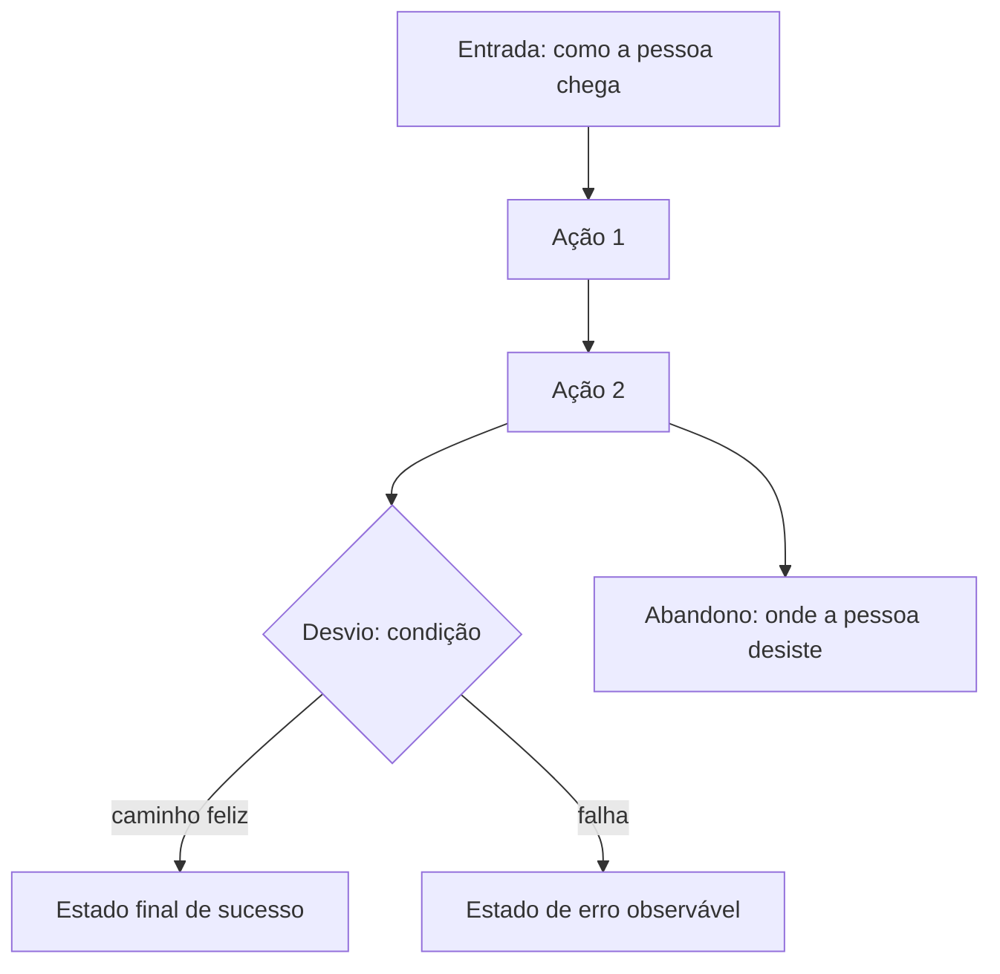

# J-[slug] — [nome da jornada]

- **Personas:** [ids de `personas.md`]
- **Objetivo do usuário:** [o que a pessoa está tentando conseguir, ponta a ponta]
- **Entrada:** [de onde a pessoa chega]
- **Estado final de sucesso:** [o que precisa ser observável no fim]
- **Área:** [área funcional, em maiúsculas — vira o `<AREA>` dos cenários]
- **Status:** [ativa | descontinuada]

## Fluxograma

## Cenários derivados

| Cenário | Cobre | Status |
|---------|-------|--------|
| [id em `scenarios/`] | [caminho principal / desvio / abandono] | [planejado / coberto] |
